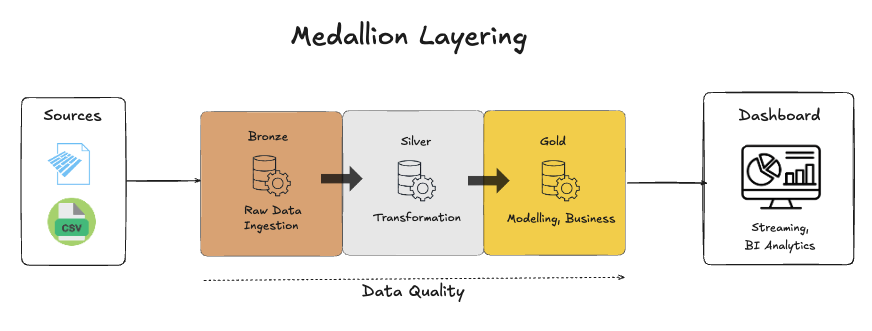
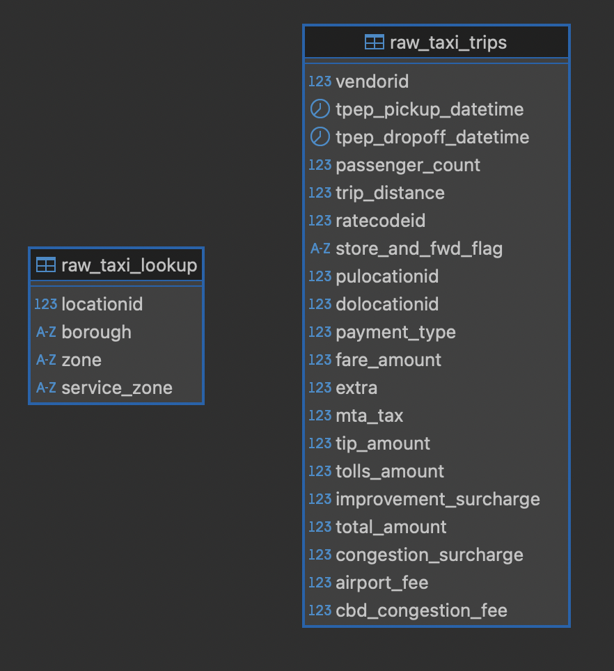
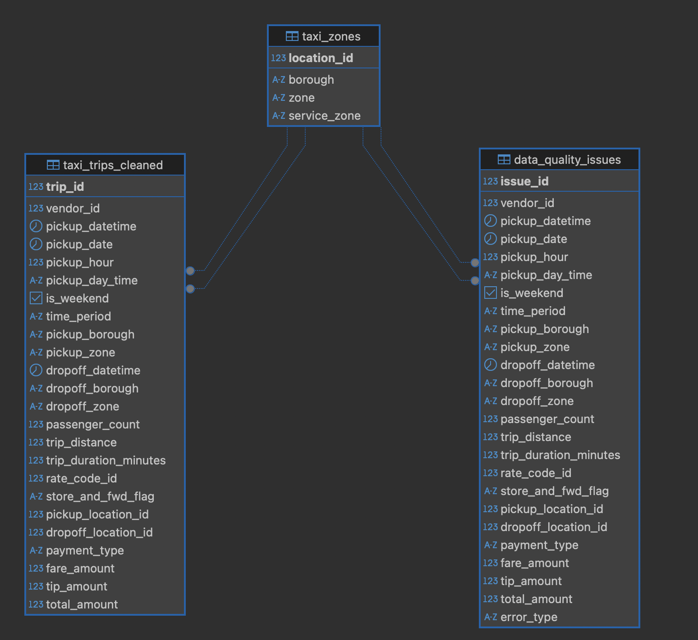
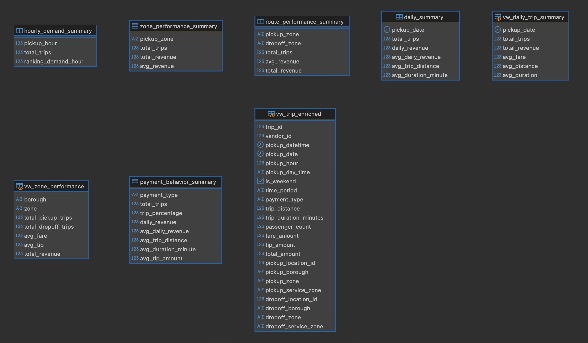
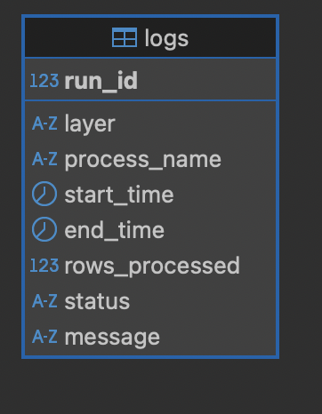

# 🚖 NYC Taxi Warehouse

A modular ETL data warehouse project built with **Python** and **PostgreSQL** using the **Medallion Architecture (Bronze, Silver, Gold)**. The pipeline extracts NYC Yellow Taxi data, performs data validation and transformation, builds analytical data marts, and generates business insights.

## Architecture

```text
NYC Taxi Dataset
        │
        ▼
    Extract
        │
        ▼
Bronze (Raw Data)
        │
        ▼
Silver (Clean & Validated)
        │
        ▼
Gold (Analytics Mart)
        │
        ▼
 Business Analytics
```

## Tech Stack

* Python
* PostgreSQL
* Pandas
* Docker & Docker Compose
* SQL

## Project Structure

```text
nyc-taxi-warehouse/
├── data/
│   └── raw/
├── db/
│   ├── init/
│   ├── queries/
│   └── schemas/
│      ├── bronze/
│      ├── silver/
│      └── gold/
├── scripts/
│   ├── run_pipeline.sh  # Entrypoint 
│   ├── main.py          # Main app
│   ├── managers/
│   ├── reporters/
│   └── layers/
│       ├── bronze/
│       ├── silver/
│       └── gold/
├── logs/
│   ├── pipeline.log
│   └── business_analytics.log
├── docs/
├── utils/
├── Dockerfile
├── docker-compose.yml
├── env.example
└── README.md
```

## Pipeline

The pipeline consists of the following stages:

1. **Extract**

   * Download the NYC Yellow Taxi trip dataset.
   * Download the Taxi Zone Lookup table.

2. **Bronze**

   * Create the database schemas and raw tables.
   * Load the original datasets into PostgreSQL using bulk loading.
   * Preserve the source data with minimal modification.

3. **Silver**

   * Clean and validate the raw data.
   * Generate business-friendly columns.
   * Separate valid and invalid records for data quality analysis.

4. **Gold**

   * Build analytical data marts.
   * Create reporting views for business analysis.

5. **Business Analytics**

   * Execute SQL queries to answer common business questions efficiently using the prepared Gold layer.
   * Save the query results into `logs/business_analytics.log`.

6. **Pipeline Report**

   * Generate an execution summary.
   * Display processed rows, execution duration, and data quality statistics.

---

## Database Layers



### Bronze



Tables:

* `raw_taxi_trips`
* `raw_taxi_lookup`

The Bronze layer stores the source data exactly as received from the NYC Taxi dataset.

### Why PostgreSQL `COPY` Instead of Row-by-Row Inserts?

Initially, the pipeline loaded millions of taxi records using conventional SQL `INSERT` statements which is with method .to_sql() in `psycopg2`. While simple to implement, this approach became a major bottleneck because every row required its own SQL execution, transaction handling, and network communication with PostgreSQL.

To improve performance, the loading process was redesigned to use PostgreSQL's `COPY` command.

The pipeline first converts the dataset into an in-memory CSV stream using Python's `StringIO`, then streams the entire dataset directly into PostgreSQL with a single `COPY FROM STDIN` operation.

This approach dramatically reduces overhead because PostgreSQL performs the bulk import internally rather than processing millions of individual insert statements.

As a result, loading millions of records became significantly faster while keeping the implementation simple and memory efficient.

```python
buffer = StringIO()
df.to_csv(buffer, index=False, header=False)
buffer.seek(0)

cur.copy_expert(
    """
    COPY bronze.raw_taxi_trips
    FROM STDIN
    WITH (FORMAT CSV)
    """,
    buffer,
)
```

This optimization became one of the biggest performance improvements in the project and is the reason the Bronze layer can ingest large datasets efficiently.


### Silver



* `taxi_trips_cleaned`
* `taxi_zones`
* `data_quality_issues`

Contains cleaned, invalid data issues and validated datasets.

### Gold



Analytical tables and views for reporting, including:

* Daily Summary
* Hourly Demand
* Zone Performance
* Payment Behavior
* Route Performance

### Audit



Logging tables for maintainable pipelines logs

## Features

* Modular ETL pipeline
* Medallion Architecture
* PostgreSQL `COPY` for fast bulk loading
* Data quality validation
* Audit logging
* SQL-based transformations
* Business analytics reports
* Docker support

## Run the Project

1. Clone the repository.

```bash
git clone https://github.com/gatotbima1104/nyc-taxi-warehouse.git

cd nyc-taxi-warehouse
```

2. Create a `.env` file from the example.

```bash
cp .env.example .env
```

3. Configure the required environment variables `Make sure the database host is POSTGRES_HOST=db following the docker setup`.

```env
# PostgreSQL
POSTGRES_HOST=db  # Note: default host=db following docker setup
POSTGRES_PORT=
POSTGRES_DB=
POSTGRES_USER=
POSTGRES_PASSWORD=
POSTGRES_URL=     # Note: default host=db following docker setup

# Dataset (Change based on your yyyy-mm needed) as dummy used 2026-01
TAXI_URL=https://d37ci6vzurychx.cloudfront.net/trip-data/yellow_tripdata_2026-01.parquet
TAXI_ZONE_LOOKUP_URL=https://d37ci6vzurychx.cloudfront.net/misc/taxi_zone_lookup.csv
TAXI_DATA_FILENAME=raw_yellow_tripdata_2026_01.parquet
TAXI_ZONE_LOOKUP_TABLE=taxi_zone_lookup.csv
```

4. Build and start the services.

```bash
docker compose up -d --build
```

```bash
bash scripts/run_pipeline.sh
```

5. Expected Output


## Report


For further analytics and seeing logs, you can dive deeper in `logs/pipeline.log` and `logs/business_analytics.log`

## Future Improvements

* Apache Airflow orchestration
* Incremental loading
* dbt transformations
* Apache Spark integration
* Cloud deployment